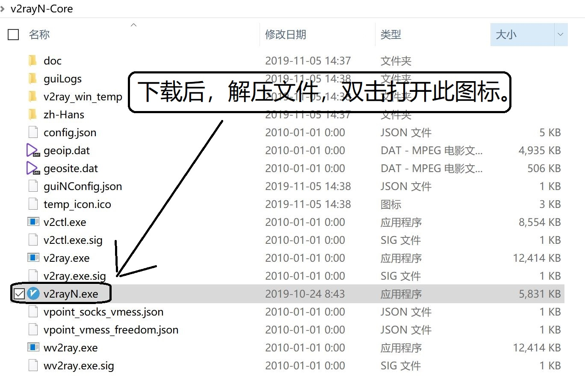
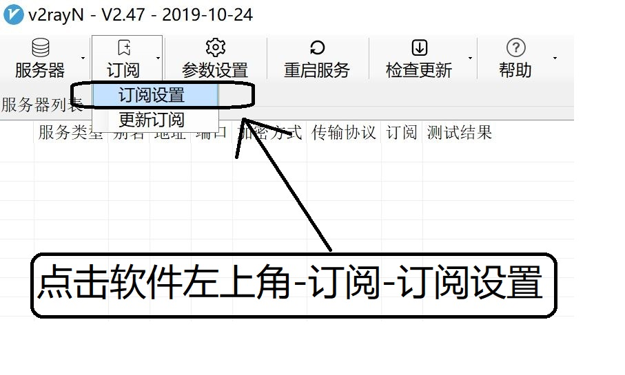
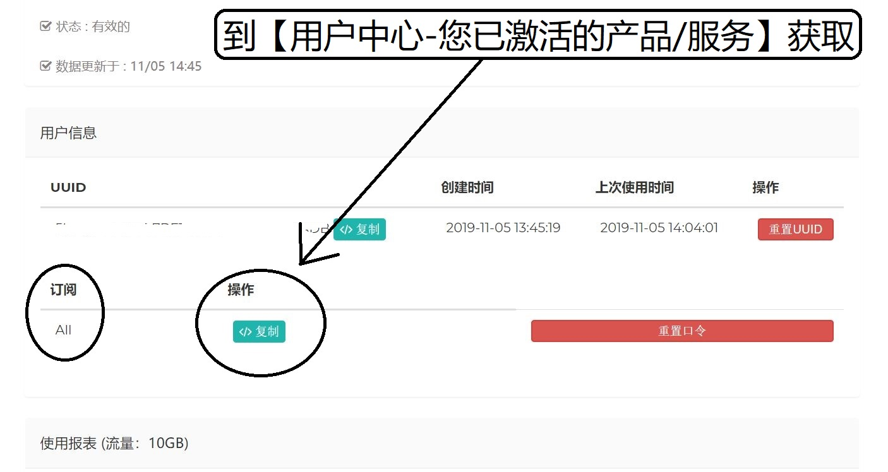
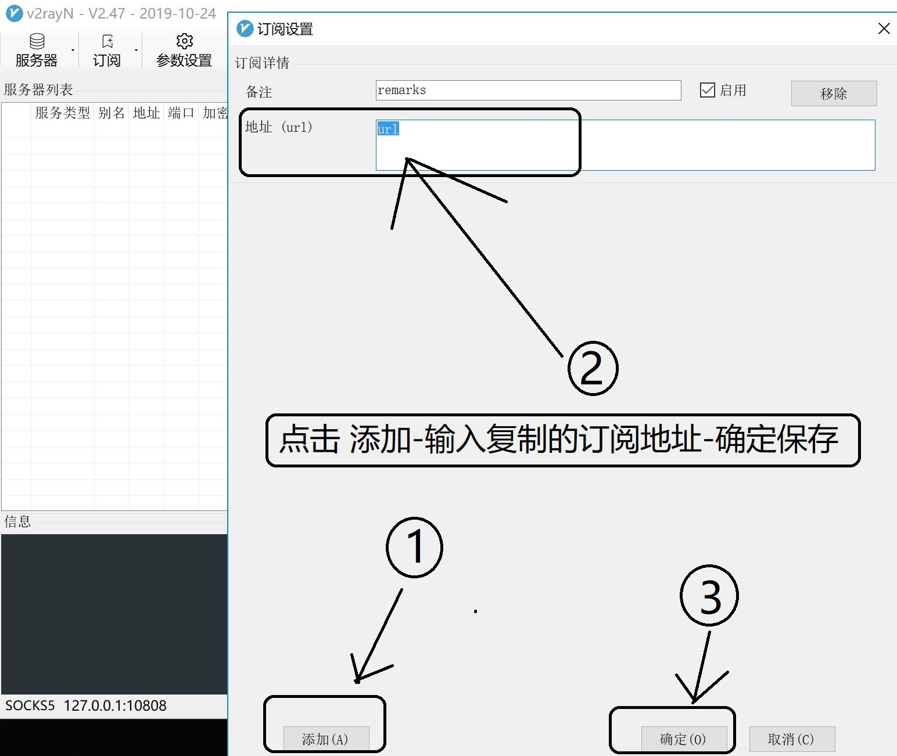
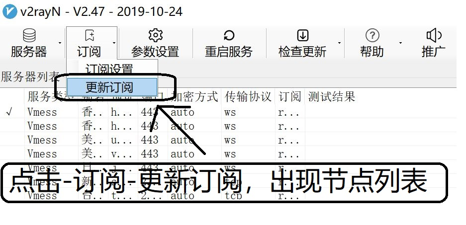
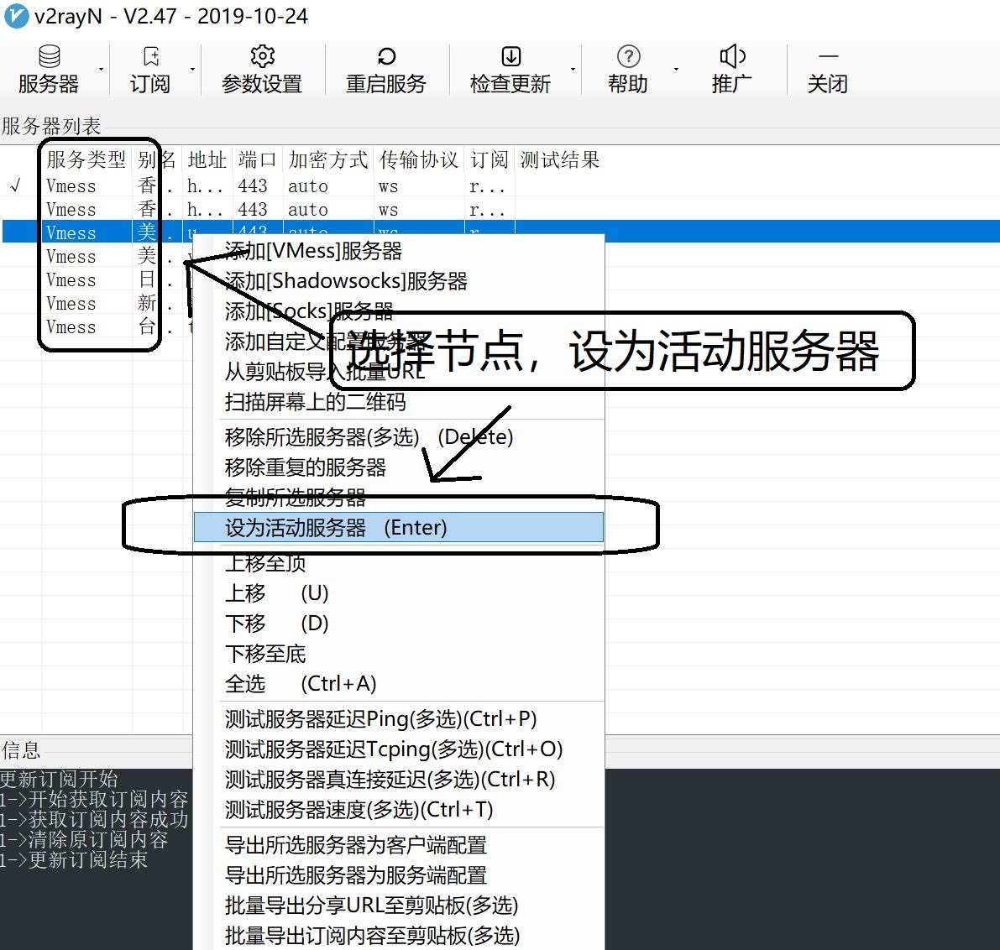
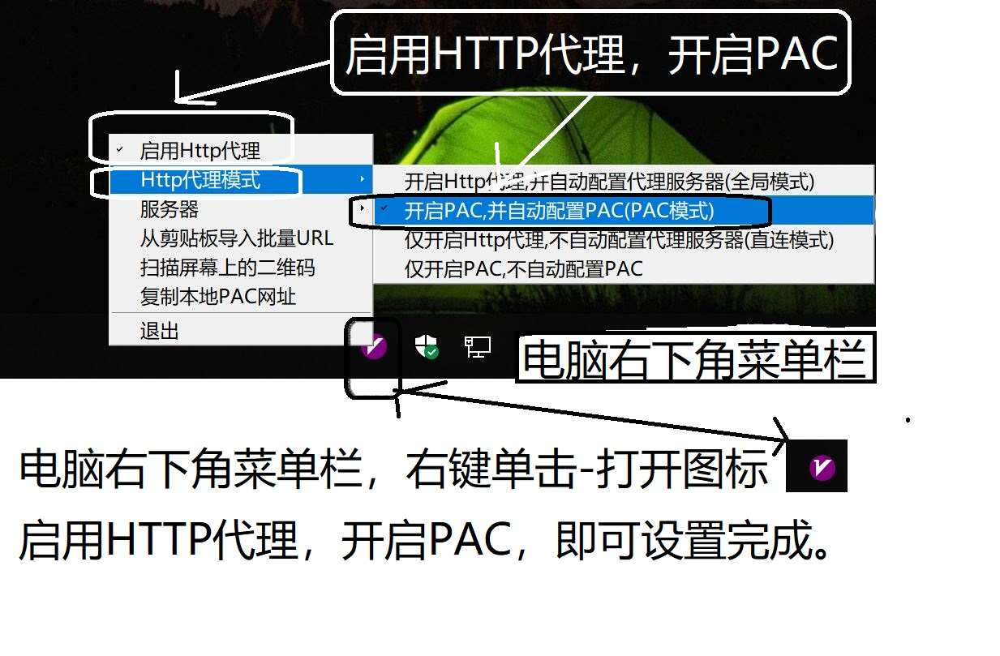

# 微软 Windows 使用 V2Ray 设置教程

[1] 下载文件：【<a title="V2Server" href="http://d.v2server.ga/down/v2rayN-Core-2.48.zip" target="_blank">v2rayN-Core</a>】【<a title="V2Server" href="http://d.v2server.ga/down/v2rayN-2.48.zip" target="_blank">v2rayN</a>】【<a title="V2Server" href="https://github.com/2dust/v2rayN/releases" target="_blank">GitHub</a>】 选择下载一个即可，下载后解压文件打开

[2] 点击软件左上角【订阅】按钮-【订阅设置】

[3] 登录网站-用户中心-我的服务 复制订阅地址

[4] 添加订阅地址左下角【添加】-粘贴【订阅地址】订阅地址-右下角点击【确定】

[5] 点击【更新订阅】-出现节点列表

[6] 选择节点右键单击-设置【设为活动服务器】

[7] 单击右下角V图标-启用HTTP代理-HTPP代理模式-开启PAC，并自动配置PAC

[8] 打开google.com进行测试

### [<< 返回首页](https://v2server.github.io/Help/)
