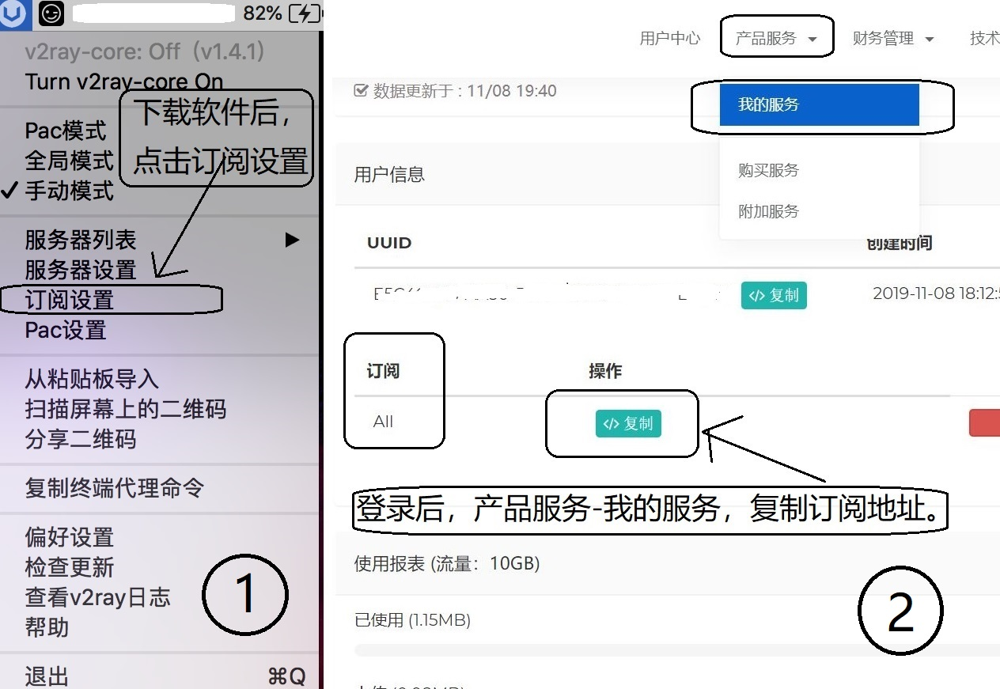
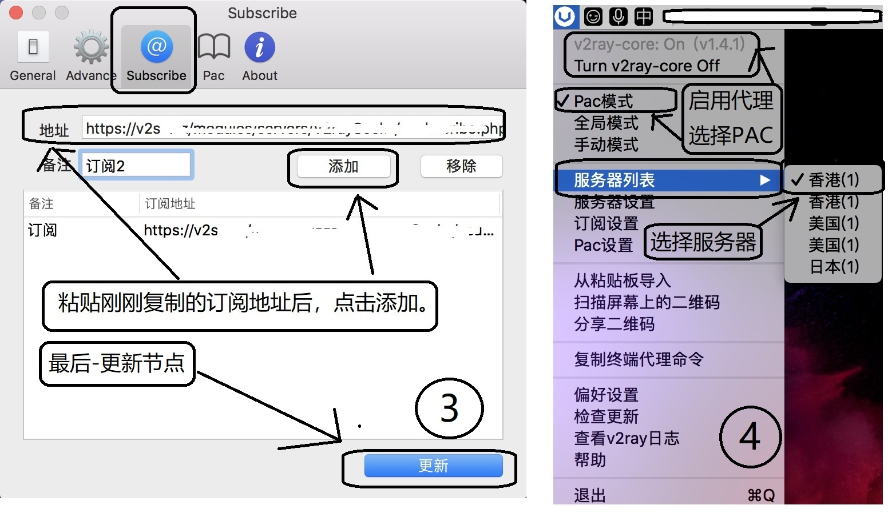

# 苹果 macOS 使用 V2Ray 设置教程

[1] 下载文件（选择下载一个）：【<a title="V2Server" href="http://d.v2server.ga/down/V2rayU-1.4.1.dmg" target="_blank">V2RayU</a>】 【<a title="V2Server" href="https://github.com/yanue/V2rayU/releases" target="_blank">GitHub</a>】 下载后安装。

[2] 打开软件后添加或者订阅节点信息，然后启用系统代理，PAC模式。

[3] 图文教程-V2rayU订阅节点

